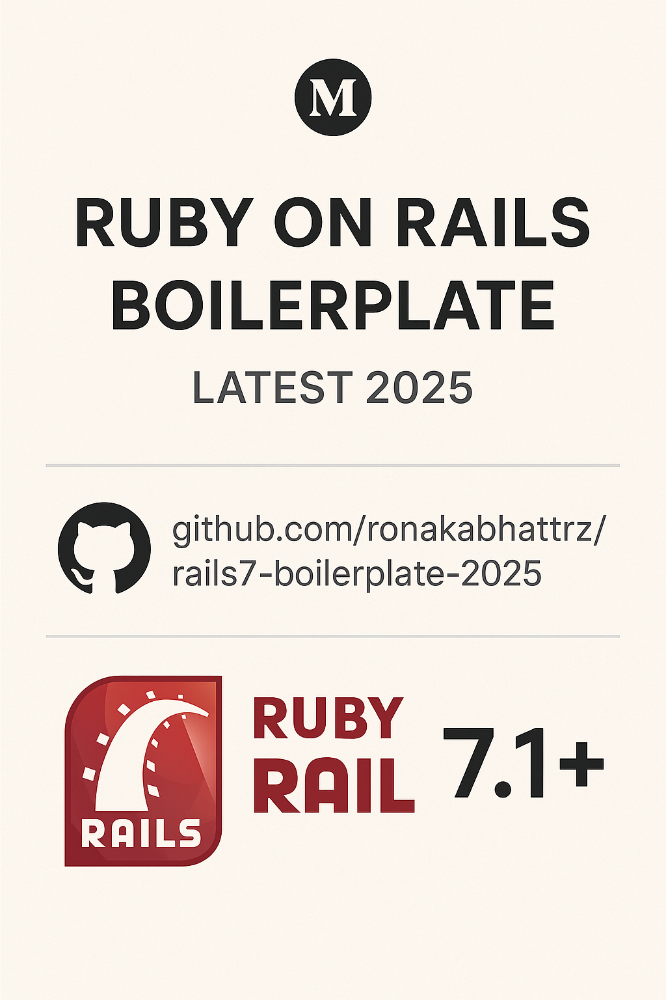

# Rails7 Boilerplate 2025

<p align="center">
  
</p>

A modern Ruby on Rails boilerplate for 2025, featuring the latest best practices, tools, and a beautiful UI out of the box.

## Features

- **Rails 7.1+** with Zeitwerk, Hotwire (Turbo & Stimulus)
- **Tailwind CSS** for modern, responsive design
- **Devise** authentication (ready for Tailwind UI & Google OAuth2)
- **API-ready** structure
- **RSpec** for testing, with FactoryBot, Capybara, Shoulda Matchers
- **Sidekiq** for background jobs
- **Docker** & `docker-compose` support
- **Code quality**: RuboCop, Brakeman, Bundler Audit
- **GitHub Actions** CI/CD scaffolded
- **Beautiful home page** and clean layout

## Prerequisites

- Ruby 3.2.2
- PostgreSQL
- Redis
- Node.js 18+
- Yarn

## Quick Start

```bash
git clone https://github.com/yourusername/rails7-boilerplate-2025.git
cd rails7-boilerplate-2025
bundle install
yarn install
rails db:create db:migrate
rails server
```

Or with Docker:

```bash
docker-compose up --build
```

Visit [http://localhost:3000](http://localhost:3000)

## Development

### Running Tests

```bash
rspec
```

### Code Quality

```bash
# Run RuboCop
rubocop

# Run Brakeman (security)
brakeman

# Run Bundle Audit
bundle audit check --update
```

### Background Jobs

```bash
# Start Sidekiq
bundle exec sidekiq
```

## Deployment

The application is configured for deployment with Docker. Build and run the containers:

```bash
docker-compose build
docker-compose up
```

## Contributing

1. Fork the repository
2. Create your feature branch (`git checkout -b feature/amazing-feature`)
3. Commit your changes (`git commit -m 'Add some amazing feature'`)
4. Push to the branch (`git push origin feature/amazing-feature`)
5. Open a Pull Request

## License

This project is licensed under the MIT License - see the [LICENSE](LICENSE) file for details.

## Author

**Ronak Bhatt**  
[GitHub](https://github.com/ronakabhattrz) | [Twitter](https://twitter.com/ronakabhattrz)

## Acknowledgments

- [Ruby on Rails](https://rubyonrails.org/)
- [Tailwind CSS](https://tailwindcss.com/)
- [Devise](https://github.com/heartcombo/devise)
- [RSpec](https://rspec.info/)
- [Sidekiq](https://sidekiq.org/)
